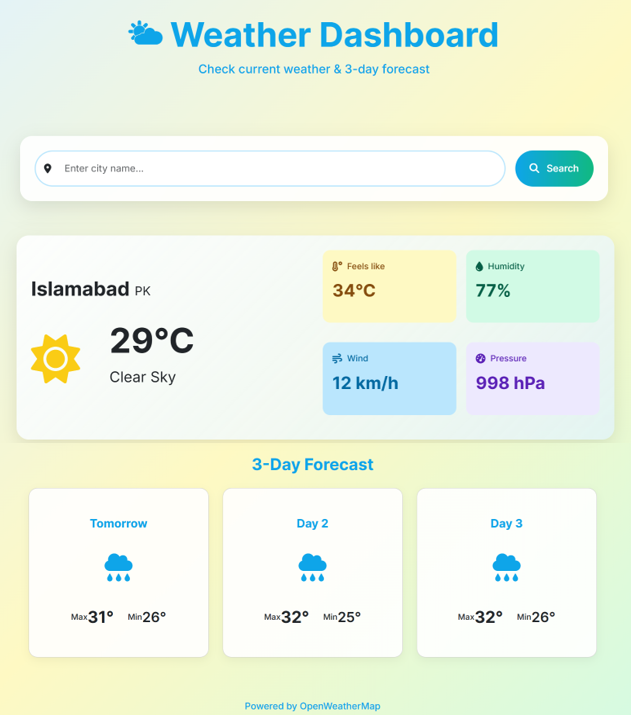

# 🌤 Weather Dashboard

A responsive weather application that displays current conditions and a 3-day forecast using the OpenWeatherMap API.



## Features

- **Current Weather Display**:
  - Temperature (°C)
  - Weather condition (e.g., "Clear Sky")
  - Feels-like temperature
  - Humidity percentage
  - Wind speed (km/h)
  - Atmospheric pressure (hPa)

- **3-Day Forecast** (excluding today):
  - Tomorrow's forecast
  - Day 2 forecast
  - Day 3 forecast
  - High/low temperatures
  - Weather condition icons

- **Search Functionality**:
  - Search any city worldwide
  - Responsive design for all devices

## Technologies Used

- **Frontend**:
  - HTML5, CSS3 (with Flexbox/Grid)
  - JavaScript (for dynamic updates)
  - Bootstrap 5 (for responsive layout)
  - Font Awesome (for icons)

- **Backend**:
  - Python Flask (lightweight web framework)
  - OpenWeatherMap API (weather data)

## Installation

1. **Clone the repository**:
   ```bash
   git clone https://github.com/zenix20/weather-dashboard.git
   cd weather-dashboard
   ```

2. **Install Dependencies**:
   ```bash
   pip install -r requirements.txt
   ```

3. **Get an API key**:
   - Sign up at OpenWeatherMap
   - Create a .env file:
   ```bash
   OPENWEATHER_API_KEY=your_api_key_here
   ```

4. **Run the application**:
   ```bash
   python app.py
   ```
   - The dashboard will be available at http://localhost:5000